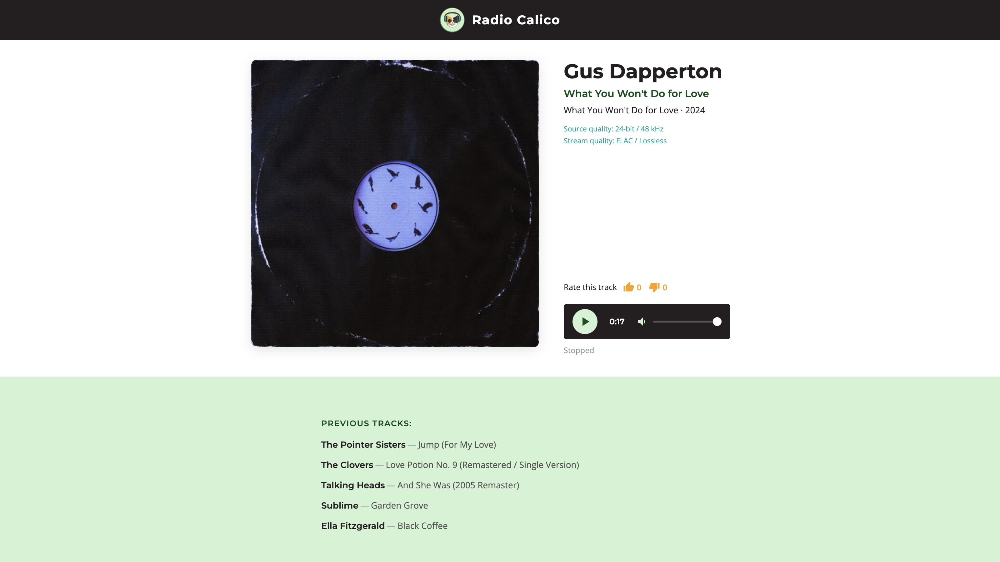

# Radio Calico

A lossless internet radio player built as a learning project using [Claude Code](https://claude.ai/code).



## About

This project was built while learning full-stack web development and Claude Code — an AI coding assistant that works directly in the terminal and editor.

## Features

- Live HLS audio stream (24-bit / 48 kHz lossless)
- Now playing info with track history
- Star ratings for tracks
- Volume control
- Ad-free

## Tech Stack

- **Frontend:** Vanilla HTML, CSS, JavaScript + [hls.js](https://github.com/video-dev/hls.js/) for audio streaming
- **Backend:** Node.js + Express 5
- **Database:** SQLite (via better-sqlite3)

## Getting Started

```bash
git clone https://github.com/YOUR-USERNAME/radio-calico.git
cd radio-calico
npm install
npm start
```

Then open [http://localhost:3000](http://localhost:3000).
